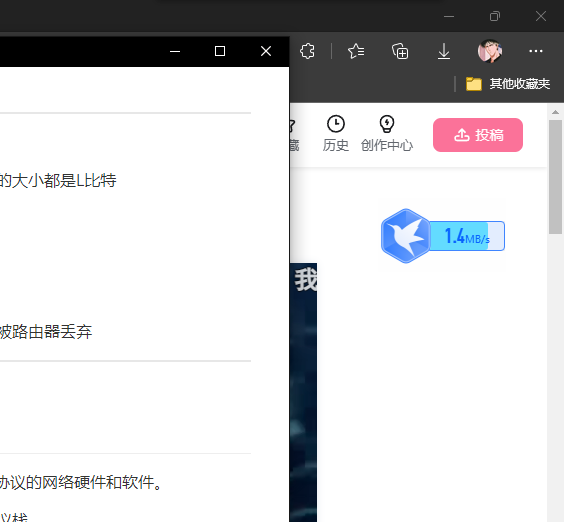

# 第一章 计算机网络和因特网

## 1.1 什么是因特网

- 端系统由通信链路和分组交换机连接到一起

当一台端系统要向另一台端系统发送数据时，发送端系统将数据分段，并为每段加上首部字节。由此形成的数据包称为：**分组**

---

- TCP和IP是因特网中最重要的协议

IP协议定义了在路由器和端系统之间发送和接收的分组格式

---

与因特网相连的端系统提供了**套接字接口**，其规定了运行在一个端系统上的程序请求因特网基础设施向运行在另一个端系统上的特定目的地程序交付数据的方式。

---

- **协议：**协议(protocol)定义了在两个或多个通信实体之间交换的报文的格式和顺序，以及报文发送和/或接收一条报文或其他事件所采取的动作。

涉及两个或多个远程通信实体的所有活动都受协议的制约

## 1.2 网络边缘

没啥好说的

## 1.3 网络核心

- 源端系统将报文划分为较小的数据块，称为分组

在源和目的地之间，每个分组都通过通信链路和分组交换机传送

交换机分为两类：

| 路由器 | 链路层交换机 |
| ------ | ------------ |

---

- ①存储转发传输

如果交换机应用了存储转发机制，则不能传输已经接收的部分比特，而是必须先缓存该分组的比特。仅当交换机接收完该分组的所有比特之后才能开始向后传输。

---

- ②排队时延和分组丢失

每台分组交换机有多条链路与之相连。

**对于每条相连的链路，该分组交换机具有一个输出缓存，也称为输出队列**

除存储转发时延外，分组还要承受输出缓存的排队时延

**由于缓存大小有限，如果缓存已满，将出现丢包，到达的分组或者已经排队的分组之一将被丢弃**

---

- ③转发表和路由选择协议

在因特网中，每个端系统具有一个称为IP地址的地址。发送分组时，源在该分组的首部包含了目的地的IP地址

**每台路由器具有一个转发表** 用于将目的地址映射成为输出链路

---

- 电路交换

端到端之间预留电路用于传输。**当创建这种连接时，也预留了恒定的传输速率**

---

**分组交换性能优于电路交换性能**

- 电路交换不考虑需求，而预先分配传输链路的使用，这使得已分配而并不需要的链路时间未被利用
- 分组交换按需分配链路使用。链路传输能力将在所有需要在链路上传输分组的用户之间逐分组地被共享

## 1.4分组交换网中的时延、丢包和吞吐量

- 时延概述：分组在传输沿途节点经受了几种不同的时延

①节点处理时延：检查分组首部和决定将该分组导向何处所需要的时间

②排队时延：分组在队列中等待传输的时间

③传输时延：将分组所有比特推向链路所需要的时间

④传播时延：在链路上运输的时间

---

- 排队时延

令a表示分组到达队列的平均速率   R为传输速率    假定所有分组的大小都是L比特

则  **La/R 为流量强度**

**设计系统时流量强度不能大于1**

- 丢包

一条链路前的队列只有有限的容量，当队列满后，到达的分组将被路由器丢弃

---

- 吞吐量    没啥好说的。。。

## 1.5 协议层次及其服务模型

- 协议分层：网络设计者以分层的方式组织协议以及实现这些协议的网络硬件和软件。

协议分层具有概念化和结构化的优点。各层的所有协议被称为协议栈。

因特网的协议栈由五个层次组成：

| 应用层 | HTTP、SMTP、FTP等，位于该层的信息分组称为报文 |
| ------ | :-------------------------------------------: |
| 运输层 |               TCP、UDP，报文段                |
| 网络层 |                    数据报                     |
| 链路层 |                    帧frame                    |
| 物理层 |                       \                       |

---

