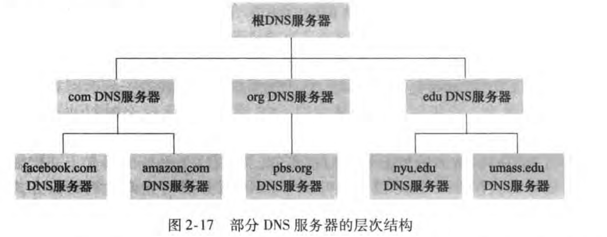

# 第一章 计算机网络和因特网

## 1.1 什么是因特网

- 端系统由通信链路和分组交换机连接到一起

当一台端系统要向另一台端系统发送数据时，发送端系统将数据分段，并为每段加上首部字节。由此形成的数据包称为：**分组**

---

- TCP和IP是因特网中最重要的协议

IP协议定义了在路由器和端系统之间发送和接收的分组格式

---

与因特网相连的端系统提供了**套接字接口**，其规定了运行在一个端系统上的程序请求因特网基础设施向运行在另一个端系统上的特定目的地程序交付数据的方式。

---

- **协议：**协议(protocol)定义了在两个或多个通信实体之间交换的报文的格式和顺序，以及报文发送和/或接收一条报文或其他事件所采取的动作。

涉及两个或多个远程通信实体的所有活动都受协议的制约

## 1.2 网络边缘

没啥好说的

## 1.3 网络核心

- 源端系统将报文划分为较小的数据块，称为分组

在源和目的地之间，每个分组都通过通信链路和分组交换机传送

交换机分为两类：

| 路由器 | 链路层交换机 |
| ------ | ------------ |

---

- ①存储转发传输

如果交换机应用了存储转发机制，则不能传输已经接收的部分比特，而是必须先缓存该分组的比特。仅当交换机接收完该分组的所有比特之后才能开始向后传输。

---

- ②排队时延和分组丢失

每台分组交换机有多条链路与之相连。

**对于每条相连的链路，该分组交换机具有一个输出缓存，也称为输出队列**

除存储转发时延外，分组还要承受输出缓存的排队时延

**由于缓存大小有限，如果缓存已满，将出现丢包，到达的分组或者已经排队的分组之一将被丢弃**

---

- ③转发表和路由选择协议

在因特网中，每个端系统具有一个称为IP地址的地址。发送分组时，源在该分组的首部包含了目的地的IP地址

**每台路由器具有一个转发表** 用于将目的地址映射成为输出链路

---

- 电路交换

端到端之间预留电路用于传输。**当创建这种连接时，也预留了恒定的传输速率**

---

**分组交换性能优于电路交换性能**

- 电路交换不考虑需求，而预先分配传输链路的使用，这使得已分配而并不需要的链路时间未被利用
- 分组交换按需分配链路使用。链路传输能力将在所有需要在链路上传输分组的用户之间逐分组地被共享

## 1.4分组交换网中的时延、丢包和吞吐量

- 时延概述：分组在传输沿途节点经受了几种不同的时延

①节点处理时延：检查分组首部和决定将该分组导向何处所需要的时间

②排队时延：分组在队列中等待传输的时间

③传输时延：将分组所有比特推向链路所需要的时间

④传播时延：在链路上运输的时间

---

- 排队时延

令a表示分组到达队列的平均速率   R为传输速率    假定所有分组的大小都是L比特

则  **L·a/R 为流量强度**

**设计系统时流量强度不能大于1**

- 丢包

一条链路前的队列只有有限的容量，当队列满后，到达的分组将被路由器丢弃

---

- 吞吐量    没啥好说的。。。

## 1.5 协议层次及其服务模型

- 协议分层：网络设计者以分层的方式组织协议以及实现这些协议的网络硬件和软件。

协议分层具有概念化和结构化的优点。各层的所有协议被称为协议栈。

因特网的协议栈由五个层次组成：

| 应用层 | HTTP、SMTP、FTP等，位于该层的信息分组称为报文 |
| ------ | :-------------------------------------------: |
| 运输层 |               TCP、UDP，报文段                |
| 网络层 |                    数据报                     |
| 链路层 |                    帧frame                    |
| 物理层 |                       \                       |

---

- 封装：

也没啥好说的...

# 第二章 应用层

## 2.1 应用层协议原理

- 进行通信的实际上是**进程**而不是程序,是运行在不同端系统上的进程之间通过跨越计算机网络交换**报文**而相互通信

---

在一对进程之间通信的场景中,发起通信的进程被标识**客户**,在会话开始时等待联系的进程是**服务器**

- 进程通过**套接字(socket)**这一软件接口发送报文和接受报文

套接字是应用层与传输层的接口

- 主机由其IP地址标识。目的地端口号用于标出接收进程。

---

传输层协议：TCP、UDP

- TCP服务：面向连接服务、可靠的数据传送服务

在应用层数据报文开始流动之前，TCP让客户和服务器糊相见欢运输层控制信息，即**握手阶段**  在握手阶段之后，一个TCP连接就在两个进程的套接字之间建立了

通信进程可以依靠TCP，无差错、按适当顺序交付所有发送的数据，没有字节的丢失和冗余。

TCP协议还具有拥塞控制机制，当双方的网络出现拥塞，TCP的拥塞控制机制会抑制发送进程

- UDP服务：无连接的，所以没有握手过程。不提供不必要服务的轻量级运输协议。UDP协议并不保证报文到达接收进程。而且到达的报文也有可能是乱序到达的。

没有拥塞控制机制	

---

SSL(Secure Sockets Layer)：安全套接字层

## 2.2 Web和HTTP

- Web的应用层协议是**超文本传输协议(HTTP)**。

Web页面是由对象组成的，一个对象只是一个文件，比如HTML文件、JPEG图形，他们都可以通过URL地址寻址。

HTTP定义了Web客户向Web服务器请求Web页面的方式，以及服务器向客户传送Web页面的方式。

HTTP使用TCP作为传输协议。HTTP客户首先发起一个与服务器的TCP连接，一旦建立，浏览器和服务器就可以通过套接字接口访问TCP。

**HTTP是一个无状态协议**，因为HTTP服务器不保存关于客户的任何信息(不存储用户的状态)。

---

- 非持续连接和持续连接

非持续连接缺点：

①必须为每一个请求的对象建立和维护一个全新的连接。对于每个这样的连接，在客户和服务器中都要分配TCP的缓冲区和保持TCP变量

②没一个对象经受两倍RTT的交付时延(即一个RTT用于创建TCP，另一个RTT用于请求和接收对象)

持续连接可以通过一个TCP连接不断请求，而不必等待未决请求(流水线)的回答。

---

- HTTP请求报文：

第一行是**请求行**，后继的行是**首部行**

请求行有三个字段：方法字段、URL字段、HTTP版本字段。

方法字段可以取几种不同的值，包括 GET、POST、HEAD、PUT、DELETE。绝大部分HTTP请求报文使用GET方法。

第二行指明了对象所在的主机，第三行是用户代理(即浏览器)

- HTTP响应报文：

一个初始状态行，六个首部行，然后是实体体。

状态行有三个字段：协议版本字段、状态码和相应状态信息。

实体体部分是报文的主要部分，即它包含了所请求的对象本身。

服务器用 Connection : close 首部行告诉客户，发送完报文后将关闭该 TCP 连接。

Content Length : 首部行指示了被发送对象中的字节数。

常见状态码：

---

- 用户与服务器交互：cookie

Web站点希望能够识别用户，把内容和用户身份联系起来。

用户首次访问一个站点时，需要提供一个用户标识。在后继会话中，浏览器向服务器传递一个cookie首部，从而向该服务器标识了用户。**因此cookie可以在无状态的HTTP之上建立一个用户会话层**

---

- Web缓存  也叫**代理服务器**

可以配置用户浏览器，使得用户所有HTTP请求首先指向Web缓存器。

---

- 条件GET方法

存放在高速缓存器中的对象副本可能是陈旧的，利用条件GET可以解决。

如果：①请求报文使用GET方法；并且②请求报文中包含一个“If-Modifued-Since:"首部行。那么这个HTTP请求报文就是条件GET请求报文。

**这一部分先自行回忆，有不清楚的看原书P74~P75**

## 2.3 电子邮件(略)

## 2.4 DNS提供的服务

DNS(域名系统)：**提供主机名到IP地址转换的目录服务**。

DNS协议运行在UDP上，使用53号端口。

---

为了使用户的主机能够讲一个HTTP请求报文发送到Web服务器，该用户主机必须获得www....的IP地址：

**DNS给使用它的因特网应用带来了额外的时延**

---

- DNS工作机理概述

为处理扩展性问题，DNS使用大量的DNS服务器，以层次方式组织，分为三种类型：根DNS服务器、顶级域(TLD)DNS服务器和权威DNS服务器。

每一个ISP都有一个本地DNS服务器，当主机与某个ISP连接时，该ISP提供一台主机的IP地址，该主机具有一台或多台其本地DNS服务器的IP地址

