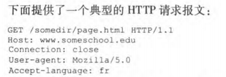
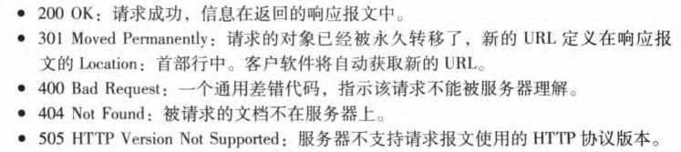

# 第一章 计算机网络和因特网

## 1.1 什么是因特网

- 端系统由通信链路和分组交换机连接到一起

当一台端系统要向另一台端系统发送数据时，发送端系统将数据分段，并为每段加上首部字节。由此形成的数据包称为：**分组**

---

- TCP和IP是因特网中最重要的协议

IP协议定义了在路由器和端系统之间发送和接收的分组格式

---

与因特网相连的端系统提供了**套接字接口**，其规定了运行在一个端系统上的程序请求因特网基础设施向运行在另一个端系统上的特定目的地程序交付数据的方式。

---

- **协议：**协议(protocol)定义了在两个或多个通信实体之间交换的报文的格式和顺序，以及报文发送和/或接收一条报文或其他事件所采取的动作。

涉及两个或多个远程通信实体的所有活动都受协议的制约

## 1.2 网络边缘

没啥好说的

## 1.3 网络核心

- 源端系统将报文划分为较小的数据块，称为分组

在源和目的地之间，每个分组都通过通信链路和分组交换机传送

交换机分为两类：

| 路由器 | 链路层交换机 |
| ------ | ------------ |

---

- ①存储转发传输

如果交换机应用了存储转发机制，则不能传输已经接收的部分比特，而是必须先缓存该分组的比特。仅当交换机接收完该分组的所有比特之后才能开始向后传输。

---

- ②排队时延和分组丢失

每台分组交换机有多条链路与之相连。

**对于每条相连的链路，该分组交换机具有一个输出缓存，也称为输出队列**

除存储转发时延外，分组还要承受输出缓存的排队时延

**由于缓存大小有限，如果缓存已满，将出现丢包，到达的分组或者已经排队的分组之一将被丢弃**

---

- ③转发表和路由选择协议

在因特网中，每个端系统具有一个称为IP地址的地址。发送分组时，源在该分组的首部包含了目的地的IP地址

**每台路由器具有一个转发表** 用于将目的地址映射成为输出链路

---

- 电路交换

端到端之间预留电路用于传输。**当创建这种连接时，也预留了恒定的传输速率**

---

**分组交换性能优于电路交换性能**

- 电路交换不考虑需求，而预先分配传输链路的使用，这使得已分配而并不需要的链路时间未被利用
- 分组交换按需分配链路使用。链路传输能力将在所有需要在链路上传输分组的用户之间逐分组地被共享

## 1.4分组交换网中的时延、丢包和吞吐量

- 时延概述：分组在传输沿途节点经受了几种不同的时延

①节点处理时延：检查分组首部和决定将该分组导向何处所需要的时间

②排队时延：分组在队列中等待传输的时间

③传输时延：将分组所有比特推向链路所需要的时间

④传播时延：在链路上运输的时间

---

- 排队时延

令a表示分组到达队列的平均速率   R为传输速率    假定所有分组的大小都是L比特

则  **L·a/R 为流量强度**

**设计系统时流量强度不能大于1**

- 丢包

一条链路前的队列只有有限的容量，当队列满后，到达的分组将被路由器丢弃

---

- 吞吐量    没啥好说的。。。

## 1.5 协议层次及其服务模型

- 协议分层：网络设计者以分层的方式组织协议以及实现这些协议的网络硬件和软件。

协议分层具有概念化和结构化的优点。各层的所有协议被称为协议栈。

因特网的协议栈由五个层次组成：

| 应用层 | HTTP、SMTP、FTP等，位于该层的信息分组称为报文 |
| ------ | :-------------------------------------------: |
| 运输层 |               TCP、UDP，报文段                |
| 网络层 |                    数据报                     |
| 链路层 |                    帧frame                    |
| 物理层 |                       \                       |

---

- 封装：

也没啥好说的...

# 第二章 应用层

## 2.1 应用层协议原理

- 进行通信的实际上是**进程**而不是程序,是运行在不同端系统上的进程之间通过跨越计算机网络交换**报文**而相互通信

---

在一对进程之间通信的场景中,发起通信的进程被标识**客户**,在会话开始时等待联系的进程是**服务器**

- 进程通过**套接字(socket)**这一软件接口发送报文和接受报文

套接字是应用层与传输层的接口

- 主机由其IP地址标识。目的地端口号用于标出接收进程。

---

传输层协议：TCP、UDP

- TCP服务：面向连接服务、可靠的数据传送服务

在应用层数据报文开始流动之前，TCP让客户和服务器糊相见欢运输层控制信息，即**握手阶段**  在握手阶段之后，一个TCP连接就在两个进程的套接字之间建立了

通信进程可以依靠TCP，无差错、按适当顺序交付所有发送的数据，没有字节的丢失和冗余。

TCP协议还具有拥塞控制机制，当双方的网络出现拥塞，TCP的拥塞控制机制会抑制发送进程

- UDP服务：无连接的，所以没有握手过程。不提供不必要服务的轻量级运输协议。UDP协议并不保证报文到达接收进程。而且到达的报文也有可能是乱序到达的。

没有拥塞控制机制	

---

SSL(Secure Sockets Layer)：安全套接字层。在**应用层**运行。

SSL套接字从应用层接收未加密的数据，对其进行加密，然后将其传递给TCP套接字。如果应用程序开发人员希望使用SSL增强TCP，则必须在应用程序中包含SSL代码。

## 2.2 Web和HTTP

- Web的应用层协议是**超文本传输协议(HTTP)**。

Web页面是由对象组成的，一个对象只是一个文件，比如HTML文件、JPEG图形，他们都可以通过URL地址寻址。

HTTP定义了Web客户向Web服务器请求Web页面的方式，以及服务器向客户传送Web页面的方式。

HTTP使用TCP作为传输协议。HTTP客户首先发起一个与服务器的TCP连接，一旦建立，浏览器和服务器就可以通过套接字接口访问TCP。

**HTTP是一个无状态协议**，因为HTTP服务器不保存关于客户的任何信息(不存储用户的状态)。

---

- 非持续连接和持续连接

非持续连接缺点：

①必须为每一个请求的对象建立和维护一个全新的连接。对于每个这样的连接，在客户和服务器中都要分配TCP的缓冲区和保持TCP变量

②没一个对象经受两倍RTT的交付时延(即一个RTT用于创建TCP，另一个RTT用于请求和接收对象)

持续连接可以通过一个TCP连接不断请求，而不必等待未决请求(流水线)的回答。

---

- HTTP请求报文：

第一行是**请求行**，后继的行是**首部行**

请求行有三个字段：方法字段、URL字段、HTTP版本字段。

方法字段可以取几种不同的值，包括 GET、POST、HEAD、PUT、DELETE。绝大部分HTTP请求报文使用GET方法。

第二行指明了对象所在的主机，第三行是用户代理(即浏览器)

- HTTP响应报文：

一个初始状态行，六个首部行，然后是实体体。

状态行有三个字段：协议版本字段、状态码和相应状态信息。

实体体部分是报文的主要部分，即它包含了所请求的对象本身。

服务器用 Connection : close 首部行告诉客户，发送完报文后将关闭该 TCP 连接。

Content Length : 首部行指示了被发送对象中的字节数。

常见状态码：

---

- 用户与服务器交互：cookie

Web站点希望能够识别用户，把内容和用户身份联系起来。

用户首次访问一个站点时，需要提供一个用户标识。在后继会话中，浏览器向服务器传递一个cookie首部，从而向该服务器标识了用户。**因此cookie可以在无状态的HTTP之上建立一个用户会话层**

---

- Web缓存  也叫**代理服务器**

可以配置用户浏览器，使得用户所有HTTP请求首先指向Web缓存器。

---

- 条件GET方法

存放在高速缓存器中的对象副本可能是陈旧的，利用条件GET可以解决。

如果：①请求报文使用GET方法；并且②请求报文中包含一个“If-Modifued-Since:"首部行。那么这个HTTP请求报文就是条件GET请求报文。

**这一部分先自行回忆，有不清楚的看原书P74~P75**

## 2.3 电子邮件(略)

## 2.4 DNS提供的服务

DNS(域名系统)：**提供主机名到IP地址转换的目录服务**。

DNS协议运行在UDP上，使用53号端口。

---

为了使用户的主机能够将一个HTTP请求报文发送到Web服务器，该用户主机必须获得www....的IP地址：

**DNS给使用它的因特网应用带来了额外的时延**

---

- DNS工作机理概述

为处理扩展性问题，DNS使用大量的DNS服务器，以层次方式组织，分为三种类型：根DNS服务器、顶级域(TLD)DNS服务器和权威DNS服务器。

每一个ISP都有一个本地DNS服务器，当主机与某个ISP连接时，该ISP提供一台主机的IP地址，该主机具有一台或多台其本地DNS服务器的IP地址

从cse.nyu.edu到dns.nyu.edu是递归查询，因为该查询是以自己的名义请求dns.nyu.edu来获得该映射；后继的三个都是迭代查询，因为所有的迭代都是返回给dns.nyu.edu

---

- DNS缓存

在一个请求链中，当某DNS服务器接收一个DNS回答，它能将映射缓存在本地存储器中。**每当接收到一个回答，它能够缓存包含在该回答中的任何信息**。

本地DNS服务器能够缓存TLD服务器的IP地址，银耳允许本地DNS绕过查询链中的根DNS服务器。事实上，因为缓存，除了少数DNS查询外，**根服务器被绕过了**。

---

- DNS记录及报文

DNS服务器存储了资源记录(RR),RR提供了主机名到IP地址的映射，资源记录是一个包括下列字段的4元组：**(Name,Value,Type,TTL)**

Name和Value的值取决于Type：

1. 如果Type=A，则Name是主机名，Value是该主机名对应的IP地址。
2. 如果Type=NS，则Name是个域，Value是直到如何获得该域中主机IP地址的权威DNS服务器的主机名
3. 如果Type=CNAME，则Value是别名为Name的主机对应的规范主机名
4. 如果Type=MX，则Value是别名为Name的邮件服务器的规范主机名

---

DNS报文

## 2.5 P2P

略.......

## 2.6 视频流和内容分发网

- HTTP流

在HTTP流中，视频只是存储在HTTP服务器中作为一个普通文件，每个文件有一个特定的URL。当用户要看该视频时，客户与服务器创建一个TCP连接并发送对该URL的HTTP GET请求。在一个HTTP响应报文中发送该视频文件。

在客户一侧，字节被手机在客户应用缓存中，一旦超过预设门限就开始播放。**特别的**，流式视频应用程序周期性从客户应用程序缓存中**抓取帧**，对这些帧解压缩并展现。所以流式视频接受到视频就开始播放，同时缓存该视频后面部分的帧。

---

- HTTP动态适应流(DASH)

因为不同客户可用带宽大小不同，所以产生了DASH。对不同的质量水平，视频编码为几个不同版本，有不同的比特率。客户用HTTP GET请求报文一次选择不同的块。

- DASH允许客户播放不同码率的视频

---

- 内容分发网(CDN)

几乎所有主要的视频流公司都利用CDN。CDN管理分布在多个地理位置上的服务器，在服务器中存储视频等内容的副本，并且将不同用户的请求定向到一个使他体验最好的一个CDN位置。

一旦CDN集群准备就绪，就可以跨集群复制内容。**事实上，许多CDN没有将视频推入集群，而是等到用户请求一个集群未存储的视频时，集群向该客户传输视频并在本地保存一个副本**，定期删除不经常请求的视频。

---

- CDN操作

当用户主机中的一个浏览器检索一个特定视频时，**CDN必须截获该请求**，以便能够①确定适合该用户的CDN服务器集群②将该客户的请求重定向到该集群的某台服务器。

**大多数CDN利用DNS来截获和重定向请求**

---

- 集群选择策略

动态地将用户定向到CDN中的某个服务器集群或数据中心的机制。

一种简单的策略：**地理上最邻近**。

为了基于当前流量条件决定最好的集群。CDN能够对其集群和客户之间的时延和丢包性能执行周期性的**实时测量**。

## 2.7 套接字编程

> UDP套接字编程

当使用UDP时，必须先将目的地址附在该分组上。在该分组穿过发送方的套接字之后，因特网将使用该目的地址通过因特网为该分组选路到接收进程的套接字。

**目的主机的IP地址是目的地址的一部分**。因为一台主机可能运行许多网络应用进程，每个进程具有一个或多个套接字，所以**在目的主机指定特定的套接字**。   当生成一个套接字时，就为它分配一个称为**端口号**的标识符。

所以分组的目的地址包括**目的主机的IP地址**和**目的地套接字的端口号**。

发送方源地址由**源主机的IP地址**和**源套接字的端口号组成**，该源地址也要附在分组上。这种操作**不是UPD应用进程做的，而是底层OS做的**。

> TCP套接字编程

TCP是一个面向连接的协议。用户和服务器开始互相发送数据之前，要先握手和创建一个TCP连接。

当创建TCP连接时，将其与**客户套接字地址(IP地址和端口号)**和**服务器套接字地址(IP地址和端口)**关联起来。使用创建的TCP连接，发送数据时，只需经过套接字将数据丢进TCP连接。而UDP在丢进套接字之前必须要附上一个目的地址。

服务器有一个**欢迎套接字**，客户进程向服务器发起一个TCP连接，由客户程序创建一个TCP套接字。当生成TCP套接字时，指定了服务器中的欢迎套接字地址(即服务器主机IP地址和套接字端口号)。生成其套接字后，该客户发起了一个**三次握手**并创建了与服务器的一个TCP连接。

在三次握手期间，客户进程联系服务器进程的欢迎套接字，当服务器响应后将生成一个新套接字，专门用于特定的客户。

# 第三章 运输层

## 3.1 概述和运输层服务

> 运输层协议为运行在不同主机上的应用进程之间提供了**逻辑通信**

应用进程使用运输层提供的逻辑通信功能彼此发送报文，而不用考虑承载这些报文的物理基础设施的细节。

---

> 将运输层分组称为**报文段**

TCP和UDP的基本责任是，将两个端系统间IP的交付服务扩展为运行在端系统上的两个进程之间的交付服务。将主机间交付扩展到进程间交付被称为**运输层的多路复用**与**多路分解**。

## 3.2 多路复用与多路分解

在目的主机上，运输层从网络层接收报文段，运输层负责将这些报文段中的数据交付给主机上运行的适当应用程序进程。

> 每个运输层报文段中具有几个字段，使接收主机将它定向到适当的套接字

在接收端，运输层检查这些字段，标识出接收套接字，进而将报文段定向到该套接字。

- 将运输层报文段中的数据交付到正确的套接字称为**多路分解**。
- 在源主机从不同套接字中手机数据块，并为每个数据块封装上首部信息从而生成报文段，然后将报文段传递到网络层，被称为**多路复用**。

运输层多路复用要求：

- 套接字有唯一标识符。
- 每个报文段有**特殊字段**指示该报文段要交付到的套接字。

特殊字段是**源端口号字段**和**目的端口号字段**。端口号是16比特数，大小在0~65535之间；0~1024是**周知端口号**，限制使用。

---

> 无连接的多路复用与多路分解

一个UDP套接字是由一个二元组全面标识的。该二元组包含**一个目的IP地址和一个目的端口号**。那么对UDP来说，源端口号有什么用呢？

在A到B的报文段中，源端口号用作"返回地址"的一部分，即当B需要回发一个报文段给A时，B到A的报文段中的目的端口号便从 A到B的报文段中的源端口号中取值。

两个具有不同源IP地址和源端口号的报文段，只要有相同的目的IP地址和目的端口号，就会被定向到同一个套接字。

> 面向连接的多路复用与多路分解

TCP套接字是由一个四元组(源IP地址，源端口号，目的IP地址，目的端口号)来标识的。

与UDP不同，两个具有不同源IP地址或源端口号的TCP报文段将被定向到两个不同的套接字。

---

> Web服务器与TCP

现代高性能Web服务器通常只是用一个进程，但是为每个新的客户连接创建一个**具有新连接套接字的新线程**。

## 3.3 无连接运输：UDP

如果应用程序开发人员选用UDP而不是TCP，那么应用程序差不多就是直接与IP打交道。UDP从应用进程得到数据，副驾上用于多路复用、分解的源和目的端口号字段，以及两个其他的小字段，将形成的报文交给网络层。

> 使用UDP的原因

- 关于发送什么数据以及合适发送的应用层控制更为精细。采用UDP时，只要应用进程将数据传递给UDP，UDP就会将此数据打包进UDP报文段并立即传递给网络层。
- 无须连接建立。TCP在开始传输数据之前需要经过三次握手。UDP不需要任何准备。
- 无连接状态。TCP需要在端系统中维护连接状态，包括接收和发送缓存、拥塞控制参数以及序号与确认号的参数。UDP不维护连接状态们也不跟踪参数。
- 分组首部开销小。**每个TCP报文段有20字节的首部开销**，**而UDP只有8字节的开销**。

---

> UDP报文段结构

## 3.4 可靠数据传输原理

